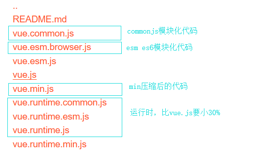

## 准备开始

## vue基础

### 历史介绍

 * angular  2009年，年份早，一开始大家是拒绝 star：33.4k
 * react  2013年，用户体验好，直接拉到一推粉丝  star：98k
 * vue   2014年，用户体验好   star：84.6k

### 前端框架与库的区别？

* Jquery库 -> DOM（操作DOM）+ 请求
* art-template库 -> 模板引擎
* 框架 = 全方位功能齐全
  * 简易的DOM体验 + 发请求 + 模板引擎 + 路由功能
* KFC的世界里，库就是一个小套餐，框架就是全家福
* 代码上的不同
  * 一般使用库的代码，是调用某个函数，我们自己把控库的代码
  * 一般使用框架，其框架在帮我们运行我们编写好的代码

### vue起步

* 1：引包 `<script src="https://cdn.jsdelivr.net/npm/vue@2.5.17/dist/vue.js"></script>`
* 2：启动 `new Vue({el:目的地,template:模板内容}) `；
* 3：options
  * 目的地 el
  * 内容 template
  * 数据  data

### vue文件介绍



### 小结案例

```html
<!DOCTYPE html>
<html>
	<head>
		<meta charset="utf-8" />
		<title>Vue.js</title>
		<!-- 1:引包 -->
		<script src="https://cdn.jsdelivr.net/npm/vue@2.5.17/dist/vue.js"></script>
		<!-- 
			vue.js是支持所有模块，min是压缩后的，初学者引入vue.js有提示
		-->
	</head>
	<body>
		<div id="app">
			
		</div>
		<!-- 通过Vue对象 去new Vue(options);  -->
		<script type="text/javascript">
			/**
			 * 使用步骤
			 * 1. 引包。具备Vue对象
			 * 2. 启动Vue	通过new Vue(options);
			 * 3. 配置options选项对象
			 * 4. el:'目的地',template:'模板'，data:function(){return {要使用的key:数据}}
			 * 5. 页面中存在该目的地，目的地字符串描述，同jq方式一样
			 */
			new Vue({
				// el: 发生行为的目的地
				/**
				 *  在vue内部运行机制中，需要根据你传递的字符串进行判断，比如：是#xxx 或者.xxx再或者是div元素查找
				 */
				// el:'#app',
				/**
				 * 更为优化，将元素直接找到，避免vue来判断
				 */
				// el:document.getBitmapById('app'),
				/**
				 * 也可以通过类名或标签名来查找
				 */ 
				el:'div',
				// template: 装载的模板
				template:'<div><h1>大家好 {{ text }}</h1></div>',
				// 动态数据的声明
				data:function(){
					// 也可以使用对象,不用太在意
					return {
						// template 的数据
						text:'hello vue'
					}
				}
			});
		</script>
	</body>
</html>

```

### 插值表达式

* {{ 表达式 }}
  * 对象（不要连续3个{{ { name:'jack'} }}）
  * 字符串 {{ 'xxx' }}
  * 判断后的布尔值 {{ true }}
  * 三元表达式 {{ true ? '正确' : '错误' }}
* 可以用于页面中简单粗暴的调试
* 注意：必须在data这个函数中返回的对象中声明

### 什么是指令

* 在vue中提供了一些对于页面 + 数据的更为方便的操作，这些操作就叫做指令，以v-xxx表示
  * 类似于html页面中的属性`<div v-xxx></div>`

* 比如在angular中以ng-xxx开头的就叫做指令
* 在vue中以v-xxx开头的就叫做指令
* 指令中封装了一些DOM行为，结合属性作为一个暗号，有对应的值，根据不同的值，框架会进行相关DOM操作的绑定

### vue中常用的v-指令演示

* v-text  元素的innerText属性，必须是双标签
* v-html 元素的innerHTML
* v-if  判断是否插入这个元素
* v-else-if
* v-else
* v-show  隐藏元素  如果确定要隐藏，会给元素的style加上display:none

### 小结案例

```html
<!DOCTYPE html>
<html>
	<head>
		<meta charset="utf-8" />
		<title>Vue.js</title>
		<script src="https://cdn.jsdelivr.net/npm/vue@2.5.17/dist/vue.js"></script>
	</head>
	<body>
		<div id="app">
			
		</div>
		<script type="text/javascript">
			/**
			 * v-text: innerText
			 * v-html:innerHTML
			 * v-if:是否插入元素
			 * v-show:是否隐藏元素
			 */
			new Vue({
				el:'#app',
				template:`
					<!-- 必须一个根节点 -->
					<div>
						<span v-text="myText"></span>
						<hr />
						<span v-html="myHtml"></span>
						<!-- <button v-if="isExit">测试v-if</button> -->
						<!-- 一下三个指令的使用，必须是相邻的DOM元素 -->
						<button v-if=" num == 1 ">测试v-if</button>
						<button v-else-if=" num == 2 ">测试v-else-if</button>
						<button v-else="">测试v-else</button>
						
						<hr />
						<button v-show="isShow">我是v-show</button>
						
					</div>
				`,
				data:function(){
					return {
						myText:'<h1>我是v-text的值!</h1>',
						myHtml:'<h1>我是v-html的值!</h1>',
						isExit:false,
						num:2,
						isShow:true
					}
				}
			});
		</script>
	</body>
</html>

```

### v-bind使用

* 给元素属性赋值

  ```html
  <div file={{ 变量 }}></div>
  ```

  * 可以给已经存在的属性赋值 `input value`
  * 也可以给定义的属性赋值

* 语法  在元素上`v-bind:属性名="常量||变量名"`

* 简写形式：`:属性名="变量名"`

  ```html
  <div v-bind:原属性名="变量"></div>
  <div :属性名="变量"></div
  ```

### v-on的使用

* 处理自定义原生事件的，给按钮添加`click`并让使用变量的样式改变
* 在元素上`v-on:原生事件名="给变量进行操作 || 函数名"`
* 简写形式:`@原生事件名=给变量进行操作`

### 阶段总结

* 如何启动vue：1.引包；2.留坑；3.启动（new Vue）
  * options：el/template/data函数
* 更便捷的操作DOM及数据v-xxx指令
  * v-text/v-html/v-if/v-show/v-bind/v-on
  * v-bind绑定属性值
  * v-on绑定事件

### v-model

* 双向数据流（绑定）
  * 页面改变影响内存（js）
  * 内存（js）改变影响页面

### v-bind和v-model的区别？

* `input v-model="name"`

  * 双向数据绑定 页面对于input的value改变，能影响内存中name变量
  * 内存js改变name的值，会影响页面重新渲染最新值

* `input :value="name"`

  * 单向数据绑定 内存改变影响页面改变

* v-model其的改变影响其他；v-bind其的改变不影响其他

* v-bind就是对属性的简单赋值，当内存中值改变，还是会触发重新渲染

  > ** 注意：**
  >
  > v-bind可以给任何属性赋值，是从vue到页面的单向数据流
  >
  > v-model只能给具备value属性的元素进行双向数据绑定（ ***必须使用的是有value属性的元素***  ）

### v-for使用

* 基本语法`v-for="item in arr"`
* 对象操作`v-for="item in obj"`
* 如果是数组没有id
  * `v-for="(item,index) in arr :class="index"`
* 各种`v-for`的属性顺序（了解）
  * 数组 item，index
  * 对象value，key，index
* class是可变的

#### 案例

```html
<!DOCTYPE html>
<html>
	<head>
		<meta charset="utf-8" />
		<title>Vue.js</title>
		<style type="text/css">
			.a{
				background-color: red;
			}
			.b{
				background-color: green;
			}
			.c{
				background-color: aqua;
			}
		</style>
		<script src="https://cdn.jsdelivr.net/npm/vue@2.5.17/dist/vue.js"></script>
	</head>
	<body>
		<div id="app"></div>
		<script type="text/javascript">
			/**
			* 补充知识点：
			*	1.v-for的使用中，除了item属性，还有一些辅助属性
			*		stus：数组：(item,index) 奇偶数不同样式 
			*		:class="index%2 == 0 ? 'red' :'green'"
			*	2.stus:对象 (value,key,index)
			*/
			new Vue({
				el:'#app',
				template:`
					<!-- 必须一个根节点 -->
					<div>
						<ul>
							<li v-for="item in stus" :class="item.myClass">{{ item.name }}</li>
						</ul>
						<hr />
						<ul>
							<li v-for="(item,key,index) in stus2">
								val:{{ item }}
								key:{{ key }}
								index:{{ index }}
							</li>
						</ul>
					</div>
				`,
				data:function(){
					return {
						stus:[
							{name:'张三',myClass:'a'},
							{name:'李四',myClass:'b'},
							{name:'王五',myClass:'c'}
						],
						stus2:{
							'A':'张山','B':'李四','C':'王五'
						}
					}
				}
			});
		</script>
	</body>
</html>
```

### 关于对象内的this

* vue已经把以前this是window或者事件对象的问题搞定了
* medthods和data本身是在同一个对象中的，所以在该对象中可以通过this随意取
* this.xxx取data中的值，this.xxxMethod调用methods中的函数

### 渲染组件-父使用子组件

* 1.创建子组件（对象）
  * `var Header = { template:'模板',data：一个函数,methods：功能,components:子组件们}`
* 2.在父组件中声明，根属性`components:{ 组件名:组件对象 }`
* 3.在父组件中要用的地方使用<组件名></组件名>
  * 在不同框架中，有的不支持大写字母，用的时候
    * 组件名 MyHeader
    * 使用 my-header
* 4.总结：有父，生子，声明，使用

#### 案例

```html
<!DOCTYPE html>
<html>
	<head>
		<meta charset="utf-8" />
		<title>Vue.js</title>
		<script src="https://cdn.jsdelivr.net/npm/vue@2.5.17/dist/vue.js"></script>
	</head>
	<body>
		<div id="app"></div>
		<script type="text/javascript">
            
            /**
             * 生出子，声明子，使用子
             */
            // 头组件
            var MyHeader = {
                template:'<div>我是头部</div>'
            }
            
            // 函数调用方式创建组件
            // 语法糖
            var MyBody = Vue.extend({
                template:'<div>我是函数调用方式的中部</div>'
            });

            // var MyBody = {
            //     template:'<div>我是中部</div>'
            // }
            
            var MyFooter = {
                template:`
                <div>
                    我是底部
                    <button @click="showNum(123)">点我</button>
                </div>
                `,
                methods:{
                    showNum:function(num){
                        alert(num);
                    }
                }
            }

            // 声明入口组件
            var App = {
                // template:'<h1>我是入口组件</h1>'
                components:{
                    'my-header':MyHeader,
                    'my-body':MyBody,
                    'my-footer':MyFooter
                },
                template:`
                    <div>
                        <my-header></my-header>
                        <my-body></my-body>
                        <my-footer></my-footer>
                    </div>
                `
            }
            
			new Vue({
                el:'#app',
                components:{
                    // 声明要用的组件们
                    // key是组件名，value是组件对象
                    app:App
                },
				template:'<app />'// 入口组件
				
            });
            
		</script>
	</body>
</html>
```

## 继续

### 父子组件传值（父传子）

* 1.父用子的时候通过属性传值
* 2.子要声明`props:['属性名']`来接收
* 3.收到就是自己的了，随便你用
  * 在`template`中直接用
  * 在js中`this.属性名`用
* 总结：父传，子声明，就是子的了
* 小补充：常量传递直接用，变量传递加冒号

### 总结父传子

* 父用子 先有子，声明子，使用子
* 父传子 父传子（属性），子声明（收），子直接用（就是自己的一样）

#### 案例

```html
<!DOCTYPE html>
<html>
	<head>
		<meta charset="utf-8" />
		<title>Vue.js</title>
		<script src="https://cdn.jsdelivr.net/npm/vue@2.5.17/dist/vue.js"></script>
	</head>
	<body>
		<div id="app"></div>
		<script type="text/javascript">

            var Son = {
                template:`
                    <div>
                        接收到父组件的数据是：{{ title }}
                        <h1 v-if="xxx">1</h1>
                        <h1 v-show="xxx">2</h1>
                        <ul>
                            <li v-for="stu in ['张山','李四']">
                                {{ stu }}
                            </li>
                        </ul>
                        <button @click="changeXxx()">改变实现</button>
                        <hr />
                        单向数据流（vue->html）:
                        <input type="text" :value="text" />
                        <hr />
                        单向数据流（vue->html->vue）:
                        <input type="text" v-model="text" />
                        <h1>
                            主要看-->
                            {{ text }}
                        </h1>
                    </div>
                `,
                // 声明接受参数
                props:['title'],
                data:function(){
                    return{
                        xxx:true,
                        text:'hello'
                    }
                },
                methods:{
                    changeXxx:function(){
                        this.xxx = !this.xxx;
                    }
                }
            }
            
            // 父向子传递，就是v-bind给元素的属性赋值
            var App = {
                // template:'<h1>我是入口组件</h1>'
                components:{
                    'son':Son
                },
                template:`
                    <div>
                        <son :title="xxx"></son>
                        <!-- 传递常量 <son title="测试"></son> -->
                    </div>
                `,
                data:function(){
                    return{
                        xxx:'我是xxx'
                    }
                }
            }
            
			new Vue({
                el:'#app',
                components:{
                    // 声明要用的组件们
                    // key是组件名，value是组件对象
                    app:App
                },
				template:'<app />'// 入口组件
				
            });
            
		</script>
	</body>
</html>
```


