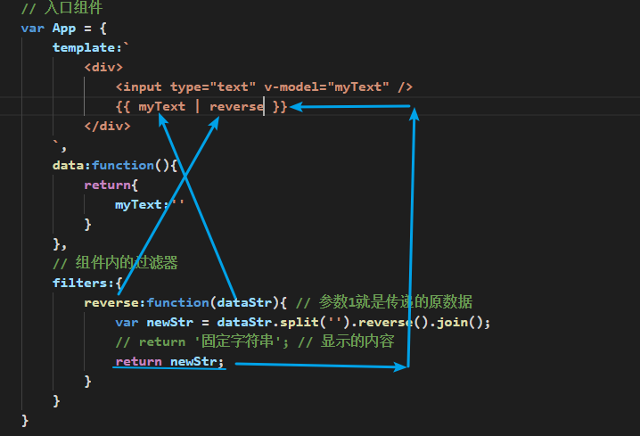

## 学员反馈

### 复习

* vue复习
  * options的根属性
    * el:目的地（string||DOM元素）
    * template 模板
    * data是一个函数，return一个对象，对象中key可以直接在页面中使用，在js中`this.key`名
      * data中的属性，在DOM中直接用，在js中`this.xxx`
    * components:key是组件名，value是组件对象
    * methods：一般用来配合`xxx`事件
    * props：子组件接收的参数设置`['title']`
  * 指令
    * `v-if/v-show`if就是插入或移除的问题，show是否隐藏的问题
    * `v-else-if/v-else`必须和`v-if`是相邻的元素
    * `v-bind/v-on`:`v-bind`是给属性赋值，`v-on`给事件进行绑定
      * `v-bind:属性="变量"`简写为`:属性名="变量"`
      * `v-on:事件名="函数"`简写为`@事件名="函数"`
    * `v-bind/v-model`:`v-bind`就是单向数据流（vue->页面),`v-model`是双向的（vue->页面，页面->vue）

### 注册全局组件

* 运用场景：多出使用的公共性功能组件，就可以注册成全局组件，减少冗余代码
* 全局API`Vue.component('组建名',组件对象)`

```html
<!DOCTYPE html>
<html>
	<head>
		<meta charset="utf-8" />
		<title>Vue.js</title>
		<script src="https://cdn.jsdelivr.net/npm/vue@2.5.17/dist/vue.js"></script>
	</head>
	<body>
		<div id="app"></div>
		<script type="text/javascript">
            // 注册公共的全局组件，省去很多的components：{xxx:Xxx}
            Vue.component('my-btn',{
                template:`
                    <button style="background-color:red;">漂亮的按钮</button>
                `
            });

            var MyHeader = {
                template:`
                    <div>
                        我是header组件
                        <my-btn/>
                    </div>
                `
            }
            
            var MyFooter = {
                template:`
                    <div>
                        我是footer组件
                        <my-btn/>
                    </div>
                `
            }

            // 入口组件
            var App = {
                components:{
                    'my-header':MyHeader,
                    'my-footer':MyFooter
                },
                template:`
                    <div>
                        <my-header></my-header>
                        <my-footer></my-footer>
                        App入口组件使用全局组件如下
                        <my-btn/>
                    </div>
                `
            }
            
			new Vue({
                el:'#app',
                components:{
                    // 声明要用的组件们
                    // key是组件名，value是组件对象
                    app:App
                },
				template:'<app />'// 入口组件
				
            });
            
		</script>
	</body>
</html>
```

### 附加功能：过滤器&监视改动



* filter || filters
  * 全局过滤器（给数据添油加醋显示）：`Vue.filter('过滤器名',过滤方式fn)`
  * 组件内的过滤器：`filters:{ '过滤器名',过滤方式fn}`
  * 将数据进行添油加醋的操作
  * 过滤器分为两种
    * 1.组件内的过滤器（组件内有效）
    * 2.全局过滤器（所有组件共享）
  * 先注册，后使用
  * 组件内`fliters:{过滤器名:过滤器fn}`最终fn内通过return产出最终的数据
  * 使用方式是`{{ 原有数据 | 过滤器名 }}`

