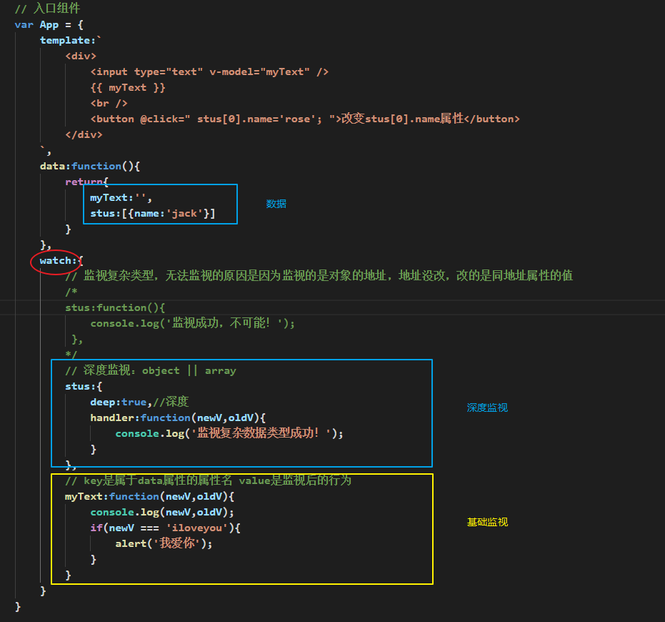

## 复习

### vue复习

* options的根属性
  * el:目的地（string||DOM元素）
  * template 模板
  * data是一个函数，return一个对象，对象中key可以直接在页面中使用，在js中`this.key`名
    * data中的属性，在DOM中直接用，在js中`this.xxx`
  * components:key是组件名，value是组件对象
  * methods：一般用来配合`xxx`事件
  * props：子组件接收的参数设置`['title']`
* 指令
  * `v-if/v-show`if就是插入或移除的问题，show是否隐藏的问题
  * `v-else-if/v-else`必须和`v-if`是相邻的元素
  * `v-bind/v-on`:`v-bind`是给属性赋值，`v-on`给事件进行绑定
    * `v-bind:属性="变量"`简写为`:属性名="变量"`
    * `v-on:事件名="函数"`简写为`@事件名="函数"`
  * `v-bind/v-model`:`v-bind`就是单向数据流（vue->页面),`v-model`是双向的（vue->页面，页面->vue）

### 注册全局组件

* 运用场景：多出使用的公共性功能组件，就可以注册成全局组件，减少冗余代码
* 全局API`Vue.component('组建名',组件对象)`

#### 全局组件案例

```html
<!DOCTYPE html>
<html>
	<head>
		<meta charset="utf-8" />
		<title>Vue.js</title>
		<script src="https://cdn.jsdelivr.net/npm/vue@2.5.17/dist/vue.js"></script>
	</head>
	<body>
		<div id="app"></div>
		<script type="text/javascript">
            // 注册公共的全局组件，省去很多的components：{xxx:Xxx}
            Vue.component('my-btn',{
                template:`
                    <button style="background-color:red;">漂亮的按钮</button>
                `
            });

            var MyHeader = {
                template:`
                    <div>
                        我是header组件
                        <my-btn/>
                    </div>
                `
            }
            
            var MyFooter = {
                template:`
                    <div>
                        我是footer组件
                        <my-btn/>
                    </div>
                `
            }

            // 入口组件
            var App = {
                components:{
                    'my-header':MyHeader,
                    'my-footer':MyFooter
                },
                template:`
                    <div>
                        <my-header></my-header>
                        <my-footer></my-footer>
                        App入口组件使用全局组件如下
                        <my-btn/>
                    </div>
                `
            }
            
			new Vue({
                el:'#app',
                components:{
                    // 声明要用的组件们
                    // key是组件名，value是组件对象
                    app:App
                },
				template:'<app />'// 入口组件
				
            });
            
		</script>
	</body>
</html>
```

### 附加功能：过滤器&监视改动


* filter || filters
  * 全局过滤器（给数据添油加醋显示）：`Vue.filter('过滤器名',过滤方式fn)`
  * 组件内的过滤器：`filters:{ '过滤器名',过滤方式fn}`
  * 将数据进行添油加醋的操作
  * 过滤器分为两种
    * 1.组件内的过滤器（组件内有效）
    * 2.全局过滤器（所有组件共享）
  * 先注册，后使用
  * 组件内`fliters:{过滤器名:过滤器fn}`最终fn内通过return产出最终的数据
  * 使用方式是`{{ 原有数据 | 过滤器名 }}`
  * 需求
    * 页面`input`框输入字符串，反转字符串输出，按参数显示label(中英文)
  * 过滤器fn：
    * 声明function(data,argv1,argv2...){}
    * 使用`{{ 数据 | 过滤器名(参数1，参数2...) }}`

#### 过滤器案例

```html
<!DOCTYPE html>
<html>
	<head>
		<meta charset="utf-8" />
		<title>Vue.js</title>
		<script src="https://cdn.jsdelivr.net/npm/vue@2.5.17/dist/vue.js"></script>
	</head>
	<body>
		<div id="app"></div>
		<script type="text/javascript">
            /**
			 * 1.过滤器可以给数据显示进行添油加醋
			 * 	需求：原本显示的数据是abc，添油加醋以后反转成cba
			 * 	需求实现：
			 * 		1.为了互动性更好，用input + v-model来获取数据到vue中
			 * 		2.输出: {{ 内容 | 使用过滤器输出 }}
			 */

            // 入口组件
            var App = {
                template:`
                    <div>
                        <input type="text" v-model="myText" />
						{{ myText | reverse('中文版') }}
                    </div>
                `,
				data:function(){
					return{
						myText:''
					}
				},
				// 组件内的过滤器
				filters:{
					reverse:function(dataStr,lang){ // 参数1就是传递的原数据
						// 			变数组				反转	  变字符串
						var newStr = dataStr.split('').reverse().join();
						// return '固定字符串'; // 显示的内容
						return lang + ':' + newStr;
					}
				}
            }
            
			// 全局过滤器 使用方式：{{ 'xxx' | myreverse('arg1') }}
			Vue.filter('myreverse',function(data,arg1){
				return 'xxx';
			});

			new Vue({
                el:'#app',
                components:{
                    // 声明要用的组件们
                    // key是组件名，value是组件对象
                    app:App
                },
				template:'<app />'// 入口组件
				
            });
            
		</script>
	</body>
</html>
```

* watch监视单个
  * 简单数据（string）基础监视，复杂数据（array，object）深度监视



* cumputed监视多个
  * computed:{ 监视的业务名:function(){ return 显示一些内容 } }
    * 使用: {{ 计算属性的名称 }}
  * 缓存机制： 包含原值不变，缓存不调用函数的优化机制


### 总结

* 全局：组件 / 过滤器 让大家直接用，全局不带s
* 过滤器：`function(原数据,参数1,参数2...){ return 结果;}`
  * 调用 `{{ '数据' | 过滤器名(参数1,参数2...)}}`
* watch单个监视
* computed群体监视

### slot

* 内置的组件
  * 不具名插槽
  * 具名插槽

#### 不具名插槽

	

#### 具名插槽


* slot就是子组件里DOM留下的坑
* <子组件>DOM</子组件>
* slot动态的DOM，props是动态的数据

### 组件生命周期

* 需要频繁的创建和销毁组件
  * 比如页面中部分内容显示与隐藏，但是用的是`v-if`
* 组件缓存
  * 内置组件中`<keep-alive>`
  * 被其包裹的组件，在`v-if="false"`的时候，不会销毁，而是停用
  * `v-if="true"`不会创建，而是激活
  * 避免频繁创建组件对象的性能损耗
* 成对比较
  * `created`和`beforeCreate`
    * A可以操作数据，B数据没有初始化
  * `mounted`和`beforeMount`
    * A可以操作DOM，B还未生成DOM
  * `updataed`和`beforeUpdate`
    * A可以获取最终数据，B可以二次修改


